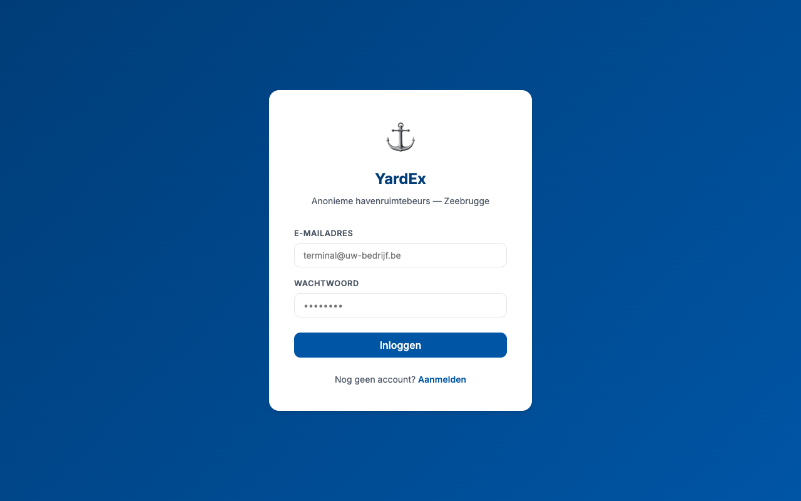
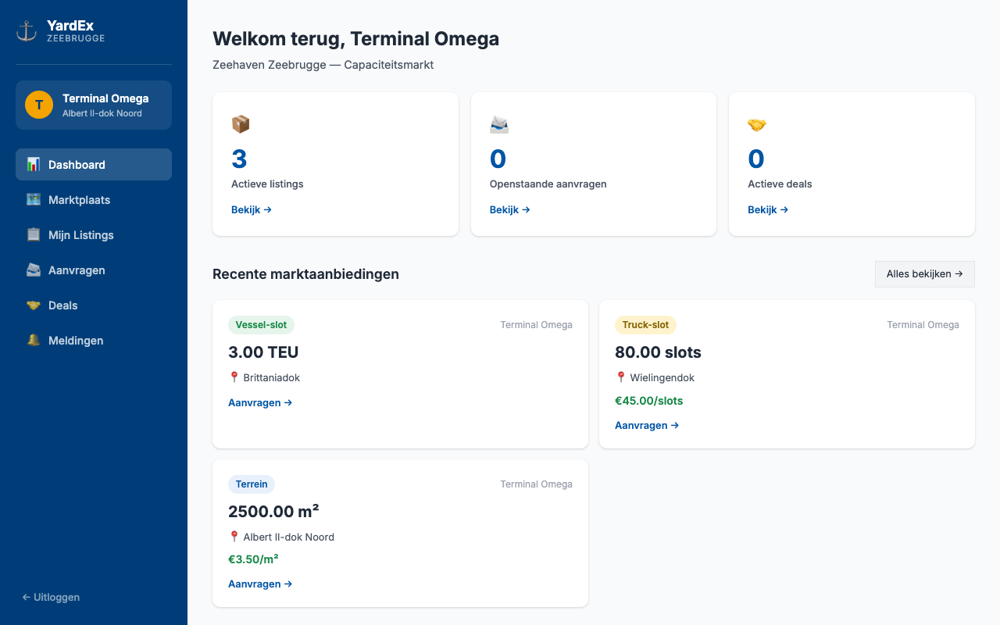
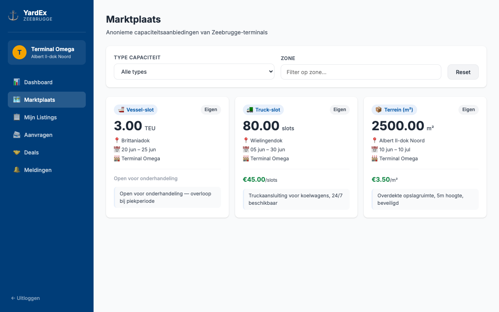
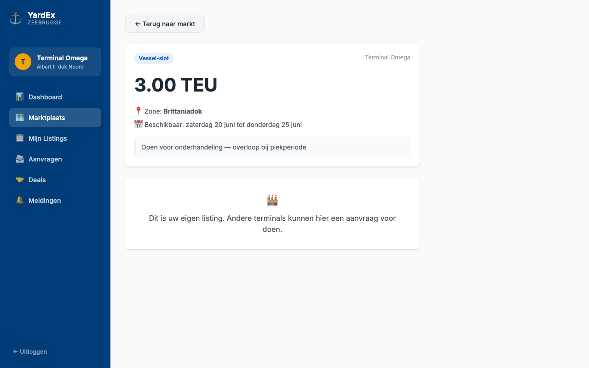
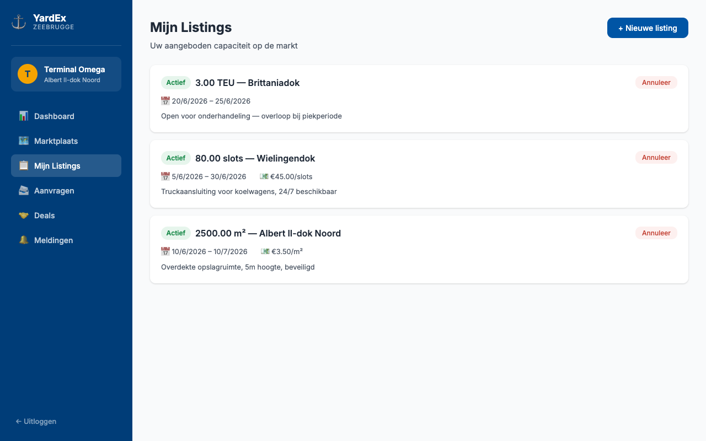
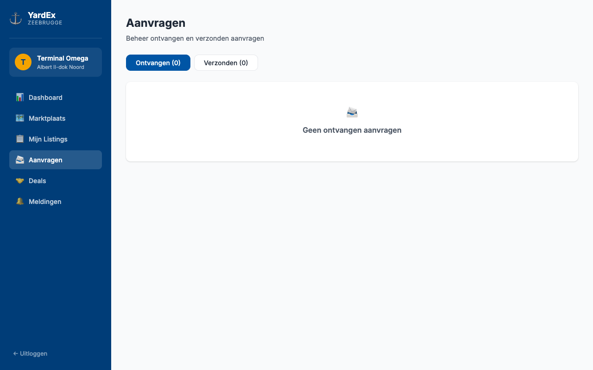

# ⚓ YardEx — Port Capacity Exchange Zeebrugge

> **Anonymous B2B marketplace** where terminals at the Port of Zeebrugge buy and sell surplus yard space, truck slots, and vessel slots — without revealing their identity until a deal is confirmed.

[](https://nodejs.org/)
[](https://react.dev/)
[](https://www.postgresql.org/)
[](https://www.docker.com/)
[](LICENSE)

---

## What is YardEx?

Port terminals regularly have unused capacity — empty yard space, idle truck gates, or unoccupied vessel berths — while neighbouring terminals are overloaded. Today, deals happen over the phone, through personal contacts, or not at all.

**YardEx changes that.** It creates a neutral, anonymous digital exchange where any terminal operator in Zeebrugge can:

- **List** surplus capacity (m², truck slots, vessel slots) with or without a fixed price
- **Browse** available capacity across all participating terminals
- **Request** a slot — anonymously, with an offered price or open negotiation
- **Close** a deal with a one-click accept/reject flow
- **Coordinate** via in-app notifications — real contact details are only revealed after a deal is confirmed

No phone tag. No commercial sensitivity. Just supply meeting demand.

---

## Screenshots

| Login | Dashboard |
|-------|-----------|
|  |  |

| Marketplace | Listing Detail |
|-------------|----------------|
|  |  |

| My Listings | Requests |
|-------------|----------|
|  |  |

---

## Architecture

```
┌─────────────────────────────────────────────────────────┐
│                      Browser (React)                    │
│  Login · Register · Dashboard · Market · Listings       │
│  Requests · Deals · Notifications                       │
└───────────────────────┬─────────────────────────────────┘
                        │ HTTP / REST (JWT)
┌───────────────────────▼─────────────────────────────────┐
│              Node.js + Express API                      │
│  /api/auth   /api/listings   /api/requests              │
│  /api/deals  /api/notifications                         │
└───────────────────────┬─────────────────────────────────┘
                        │ pg (node-postgres)
┌───────────────────────▼─────────────────────────────────┐
│                    PostgreSQL 16                         │
│  companies · listings · requests · deals · notifications│
│  (UUID PKs · anonymised aliases · audit timestamps)     │
└─────────────────────────────────────────────────────────┘
```

**Privacy by design:** company names and emails are never exposed in API responses. Other terminals see only the alias (e.g. *"Terminal Alfa"*). Real contact details are stored separately and revealed only after both parties confirm a deal.

---

## Features

| Feature | Description |
|---------|-------------|
| **Anonymous marketplace** | Terminals see only aliases — never real names or emails |
| **3 capacity types** | Yard space (m²), truck slots, vessel slots (TEU) |
| **Flexible pricing** | Fixed price per unit or open-to-negotiation |
| **Request flow** | Anonymous booking requests with a counter-offer price |
| **Accept / Reject** | One-click deal confirmation with automatic status updates |
| **In-app notifications** | Real-time updates for new listings and incoming requests |
| **Dashboard** | Overview of active capacity, open requests, and confirmed deals |
| **Zone filtering** | Filter by Zeebrugge dock zone (Albert II, Wielingendok, etc.) |

---

## Tech Stack

| Layer | Technology |
|-------|-----------|
| Frontend | React 18, React Router v6, Vite 5, CSS custom properties |
| Backend | Node.js 20, Express 4, JWT (7-day tokens) |
| Database | PostgreSQL 16, UUID primary keys, `pg` driver |
| Auth | bcryptjs password hashing, JWT Bearer tokens |
| Dev tools | Nodemon, Docker Compose |

---

## Quick Start

### Option A — Docker (recommended)

```bash
git clone https://github.com/KippieG/yard-slot-sharer.git
cd yard-slot-sharer

# Start PostgreSQL
docker-compose up -d

# Seed schema
docker exec -i yard-slot-sharer-postgres-1 \
  psql -U postgres yardex < database/migrations/001_init.sql
docker exec -i yard-slot-sharer-postgres-1 \
  psql -U postgres yardex < database/migrations/002_contact_fields.sql

# Start server
cd server && cp .env.example .env && npm install && npm run dev &

# Start client (new tab)
cd ../client && npm install && npm run dev
```

App runs at **http://localhost:5173**

---

### Option B — Manual (existing PostgreSQL)

**1. Database**

```bash
createdb yardex
psql yardex < database/migrations/001_init.sql
psql yardex < database/migrations/002_contact_fields.sql
```

**2. Server**

```bash
cd server
cp .env.example .env
# Edit .env with your DB credentials and a strong JWT_SECRET
npm install
npm run dev         # http://localhost:3001
```

**3. Client**

```bash
cd client
npm install
npm run dev         # http://localhost:5173
```

---

## Environment Variables

All variables live in `server/.env` (copy from `.env.example`):

| Variable | Default | Description |
|----------|---------|-------------|
| `DB_HOST` | `localhost` | PostgreSQL host |
| `DB_PORT` | `5432` | PostgreSQL port |
| `DB_NAME` | `yardex` | Database name |
| `DB_USER` | `postgres` | Database user |
| `DB_PASSWORD` | `postgres` | Database password |
| `JWT_SECRET` | — | **Required.** Long random string for signing tokens |
| `PORT` | `3001` | API server port |
| `CLIENT_URL` | `http://localhost:5173` | CORS allowed origin |

---

## API Overview

All endpoints (except `/api/health`) require `Authorization: Bearer <token>`.

| Method | Endpoint | Description |
|--------|----------|-------------|
| `POST` | `/api/auth/register` | Register a new terminal account |
| `POST` | `/api/auth/login` | Login, returns JWT |
| `GET` | `/api/auth/me` | Get current company profile |
| `GET` | `/api/listings` | List all active listings (anonymised) |
| `POST` | `/api/listings` | Create a new listing |
| `GET` | `/api/listings/my/listings` | Get your own listings |
| `PATCH` | `/api/listings/:id/cancel` | Cancel a listing |
| `GET` | `/api/requests` | Get received requests |
| `POST` | `/api/requests` | Submit a booking request |
| `PATCH` | `/api/requests/:id/accept` | Accept a request → creates a deal |
| `PATCH` | `/api/requests/:id/reject` | Reject a request |
| `GET` | `/api/deals` | List all your deals |
| `GET` | `/api/notifications` | Get notifications |
| `PATCH` | `/api/notifications/:id/read` | Mark notification as read |
| `GET` | `/api/health` | Health check |

---

## Database Schema

```
companies          listings              requests
──────────         ────────              ────────
id (UUID) ◄──┐    id (UUID)             id (UUID)
alias          │    company_id ──────────►│    listing_id ──►listings.id
email          │    type (enum)           │    requesting_company_id
password_hash  │    capacity              │    quantity_needed
zone           │    unit                  │    offered_price
verified       └────available_from/until  │    status (enum)
                    price_per_unit        │
                    status (enum)         ▼
                                     deals
                                     ──────
                                     provider_company_id
                                     requester_company_id
                                     agreed_quantity / price
                                     status (enum)
```

---

## Database Migrations

| File | Description |
|------|-------------|
| `001_init.sql` | Core schema + 5 seed terminals |
| `002_contact_fields.sql` | Real contact details (revealed post-deal) |

---

## Business Model

| Revenue stream | Details |
|----------------|---------|
| **Transaction fee** | 2–4% commission per confirmed deal |
| **Analytics subscription** | Monthly fee per terminal for usage dashboard |
| **TOS API integration** | Premium tier — direct integration with Navis N4 / CargoWise |

---

## Roadmap

- [ ] Email notifications (SendGrid) on new matches and deal confirmations
- [ ] AI price suggester based on historical port utilisation data
- [ ] TOS integration — Navis N4 API for real-time slot availability
- [ ] Stripe payment processing with escrow for disputed deals
- [ ] Multi-port rollout: Antwerp (PSA, DP World, MSC), Ghent
- [ ] Mobile app (React Native)

---

## Contributing

1. Fork the repo and create a feature branch: `git checkout -b feat/your-feature`
2. Make your changes and ensure no regressions
3. Open a pull request with a clear description

---

## License

MIT © Philippe Godfroy

---

*Built for the port logistics sector — Zeebrugge, Belgium.*
